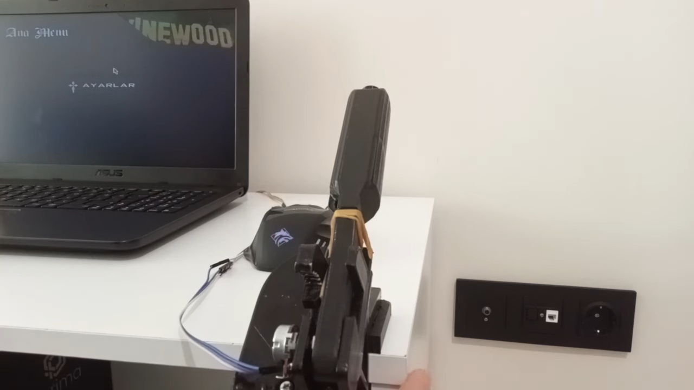

# Arduino ile El Freni Projesi
Bu proje, Arduino ve 3D baskı kullanarak bir simulasyon oyununa özel bir el freni yapma konusunda detaylı bir rehber sunmaktadır. Aşağıda malzeme listesi, 3D modellerin indirme linkleri ve Arduino kodunu bulabilirsiniz.

> İşte montajı tamamlanmış haliyle el freni



Video izlemek için [YouTube'da Proje Videomuzu izleyin](https://www.youtube.com/watch?v=PAkyEOsQQE8)

## Malzeme Listesi
- **Arduino Leonardo**
- **300 Gram Filament** 
- **Potansiyometre 1KΩ**
- **M3 10mm Civata ve Somun (4 Adet)**
<!-- Diğer malzemeleri buraya ekleyin -->

## 3D Modellerin İndirme Linkleri
- [Ana Modeller](https://www.printables.com/en/model/355044-pi-pico-handbrake-controller-v1)
- [Masa Yükselteci](https://www.thingiverse.com/thing:6457553)

## Arduino Kodu
```cpp
/***************************************************************************
*                                                                          *
*       En Basit Yoldan Arduino İle Simülasyon El Freni Yapımı             *
*                         BERATRONİK 2024                                  *
*                                                                          *
*       Youtube: https://www.youtube.com/watch?v=PAkyEOsQQE8               *
*                                                                          *
***************************************************************************/

#include "Keyboard.h"

const int analogPin = A0;  // Potun orta bacağının bağlandığı analog pin numarası
const int minAxis = 0;     // Potansiyometrenin en düşük değeri
const int maxAxis = 50;    // Potansiyometrenin en yüksek değeri
const int buttonCutoff = 5;  // Düğme basma durumunu belirlemek için analog eşik değeri

void setup() {
  Serial.begin(115200);
  
  pinMode(LED_BUILTIN, OUTPUT);
  digitalWrite(LED_BUILTIN, HIGH);  // LED'i aç

  pinMode(analogPin, INPUT);
}

void loop() {
  // Analog pininden gelen giriş değerini al
  int val = analogRead(analogPin);

  // Potansiyometrenin en düşük ve en yüksek değerleri arasındaki değeri klavye tuşu basma/bırakma işlemine haritala
  val = constrain(val, minAxis, maxAxis);
  if (val > buttonCutoff) {
    Keyboard.press('0');
    delay(50);  // İhtiyacınıza göre bu gecikmeyi ayarlayın
  } else {
    Keyboard.release('0');
  }

  delay(50);  // İhtiyacınıza göre bu gecikmeyi ayarlayın
}
